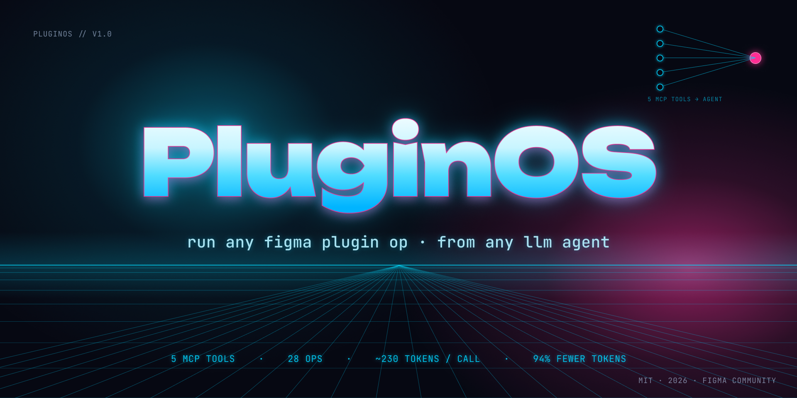

# PluginOS

[](https://www.npmjs.com/package/pluginos)

Agent-native Figma operations platform. Run any Figma plugin operation from any LLM agent at **~230 tokens per call** instead of ~28,000.



## Why PluginOS

Traditional Figma MCP integrations register dozens of tools — each with a full JSON schema the LLM must read on every conversation turn. For a server with 80+ tools, that's **~12,000 tokens of overhead before the agent even does anything.**

PluginOS takes a fundamentally different approach:

- **5 MCP tools, unlimited operations.** The server is a thin router. Operations are discovered dynamically, not hardcoded as tool schemas.
- **15x cheaper per workflow.** A complex multi-step task costs ~6,600 tokens vs ~105,000 with traditional approaches — 94% savings.
- **Pre-summarized results.** Operations return structured summaries, not raw node dumps. Agents reason better with less noise.
- **Extensible by design.** Add custom operations as simple manifest + execute pairs. No server changes needed.
- **Multi-file support.** Connect multiple Figma files simultaneously. The server tracks active files and routes operations to the right one.

## Quick Start

### 1. Install for your agent

Pick whichever tool you're using. The Bridge Plugin (step 2) is the same for all of them.

**Claude Desktop (recommended for designers — one click):**

1. Download [`pluginos.dxt`](https://github.com/LSDimi/pluginos/releases/latest/download/pluginos.dxt) from the latest GitHub Release.
2. Double-click the downloaded file. Claude Desktop opens an install dialog.
3. Confirm. PluginOS appears in Claude Desktop's connector list.

No JSON editing, no terminal. Note: Claude.ai web is **not** supported — it cannot reach local MCP servers.

**Cursor (`.cursor/mcp.json`):**

```json
{
  "mcpServers": {
    "pluginos": {
      "command": "npx",
      "args": ["-y", "pluginos@latest"]
    }
  }
}
```

Then paste the Tier 1 rules below into `.cursorrules` so Cursor prefers PluginOS over the generic Figma MCP.

**Claude Code (CLI — engineers):**

```bash
/plugin marketplace add github:LSDimi/pluginos
/plugin install pluginos
```

Installs the MCP server registration and the `pluginos-figma` skill in one step.

**Manual (advanced — edit `claude_desktop_config.json` directly):**

```json
{
  "mcpServers": {
    "pluginos": {
      "command": "npx",
      "args": ["-y", "pluginos@latest"]
    }
  }
}
```

Then paste the Tier 1 rules below into your project's custom instructions.

**Tier 1 rules (Cursor / Claude Desktop):**

```
When working with Figma, always use PluginOS tools exclusively:
- Use `list_operations` (pluginos) first to discover available Figma operations.
- Use `run_operation` (pluginos) to execute them.
- Use `execute_figma` (pluginos) only for one-off custom logic not covered by built-in ops.
- Do NOT use `mcp__Figma__*` tools — they bypass the plugin and return raw, token-heavy data. PluginOS returns pre-summarized, structured results at ~230 tokens/call.
- If PluginOS returns "No plugin connected", open the PluginOS Bridge plugin in Figma before retrying.

Audit/lint/check operations default to `scope: "selection"`. Pass `scope: "page"` explicitly (and `confirm: true` for pages over 500 nodes) to scan the whole page. Responses carry `_hint` and `_next_hints` fields — respect them when deciding what to do next.
```

### 2. Install the Bridge Plugin in Figma

1. Open Figma Desktop
2. Right-click canvas > Plugins > Development > Import plugin from manifest
3. Select `packages/bridge-plugin/manifest.json`
4. Run the plugin — it auto-connects to the MCP server

### 3. Use it

Tell your agent:

> "Check the contrast ratios in my design"

The agent calls `run_operation("check_contrast", {scope: "page"})` and gets back a clean summary. ~230 tokens, done.

> "Create a 300x200 frame with auto-layout and add some text"

The agent calls write operations to create frames, set text, and modify fills — all through the same 5-tool interface.

## How It Works

```
Agent ── MCP (stdio) ──> PluginOS Server ── WebSocket ──> Bridge Plugin ──> Figma
         5 tools           thin router        localhost      26 operations    full API
         ~600 tokens       routes by name     ports 9500-    executes locally figma.*
         per turn          + params only      9510           returns summaries
```

**Two execution paths:**

| Path         | When                        | Token cost  | How                                                          |
| ------------ | --------------------------- | ----------- | ------------------------------------------------------------ |
| **Fast**     | Built-in operation exists   | ~230 tokens | `run_operation("check_contrast", {scope: "page"})`           |
| **Fallback** | Custom/one-off logic needed | ~700 tokens | `execute_figma("return figma.currentPage.findAll().length")` |

## Available Operations (26)

| Operation               | Category      | Description                         |
| ----------------------- | ------------- | ----------------------------------- |
| `lint_styles`           | lint          | Find layers without styles          |
| `lint_detached`         | lint          | Find detached instances             |
| `lint_naming`           | lint          | Find default-named layers           |
| `check_contrast`        | accessibility | WCAG contrast audit                 |
| `check_touch_targets`   | accessibility | Touch target size check             |
| `find_instances`        | components    | Find component instances            |
| `analyze_overrides`     | components    | Report instance overrides           |
| `create_frame`          | components    | Create frames with auto-layout      |
| `clone_node`            | components    | Clone and reposition nodes          |
| `rename_layers`         | cleanup       | Batch rename layers                 |
| `remove_hidden`         | cleanup       | Remove hidden layers                |
| `round_values`          | cleanup       | Round fractional values             |
| `delete_node`           | cleanup       | Delete nodes by ID                  |
| `list_variables`        | tokens        | List all variables                  |
| `export_tokens`         | tokens        | Export tokens as JSON               |
| `audit_spacing`         | layout        | Audit spacing values                |
| `move_node`             | layout        | Move nodes to new positions         |
| `resize_node`           | layout        | Resize nodes                        |
| `set_fills`             | colors        | Set fill colors on nodes            |
| `extract_palette`       | colors        | Extract unique colors with counts   |
| `find_non_style_colors` | colors        | Find hardcoded (unstyled) colors    |
| `audit_text_styles`     | typography    | Audit font/size/weight consistency  |
| `list_fonts`            | typography    | List all fonts with usage counts    |
| `set_text`              | content       | Set text content on nodes           |
| `populate_text`         | content       | Fill text with lorem or custom text |
| `extract_css`           | export        | Extract CSS properties from nodes   |

## Token Economics

| Scenario                        | Traditional MCP | PluginOS      | Savings |
| ------------------------------- | --------------- | ------------- | ------- |
| Tool schema overhead (per turn) | ~12,000 tokens  | ~650 tokens   | 95%     |
| Single operation call           | ~1,500 tokens   | ~230 tokens   | 85%     |
| Complex workflow (8 steps)      | ~105,000 tokens | ~6,600 tokens | 94%     |
| 10 users × 5 runs/day × 30 days | ~157M tokens    | ~10M tokens   | 94%     |

## Adding Custom Operations

Create a file in `packages/bridge-plugin/src/operations/`:

```typescript
import { registerOperation } from "./registry";

registerOperation({
  manifest: {
    name: "my_operation",
    description: "What it does",
    category: "custom",
    params: {
      scope: { type: "string", required: false, description: "'page' or 'selection'" },
    },
    returns: "{ result, summary }",
  },
  async execute(params) {
    const nodes = figma.currentPage.findAll();
    return { result: nodes.length, summary: `Found ${nodes.length} nodes.` };
  },
});
```

Register it in `operations/index.ts` and rebuild. The agent discovers it automatically via `list_operations`.

## Architecture

```
packages/
  shared/          Types, protocol messages, categories
  mcp-server/      MCP server (stdio) + WebSocket + HTTP (bootloader)
  bridge-plugin/   Figma plugin (webpack -> code.js + bootloader.html)
```

- **Monorepo** with npm workspaces
- **MCP protocol** over stdio (server <> agent)
- **WebSocket** on localhost:9500-9510 (server <> plugin)
- **Bootloader pattern** — plugin fetches fresh UI from server on startup
- **Port scanning** — plugin auto-discovers the server
- **Multi-file** — multiple Figma files connect simultaneously

## Development

> **All commands must be run from the repo root** (`PluginOS-main/` or wherever you cloned/unzipped it). Running them from inside a package subfolder will fail.

```bash
# 1. Install all dependencies (run once from repo root)
npm install

# 2. Build shared types first — mcp-server depends on them
npm run build -w packages/shared

# 3. Build the Figma bridge plugin (outputs to packages/bridge-plugin/dist/)
npm run build -w packages/bridge-plugin

# 4. Load the plugin in Figma
#    Figma → Plugins → Development → Import plugin from manifest
#    Select: packages/bridge-plugin/manifest.json
```

```bash
# Hot-reload development
npm run dev:server    # MCP server with hot reload
npm run dev:plugin    # Webpack watch for bridge plugin
npm test              # Tests across all packages
```

## License

MIT
